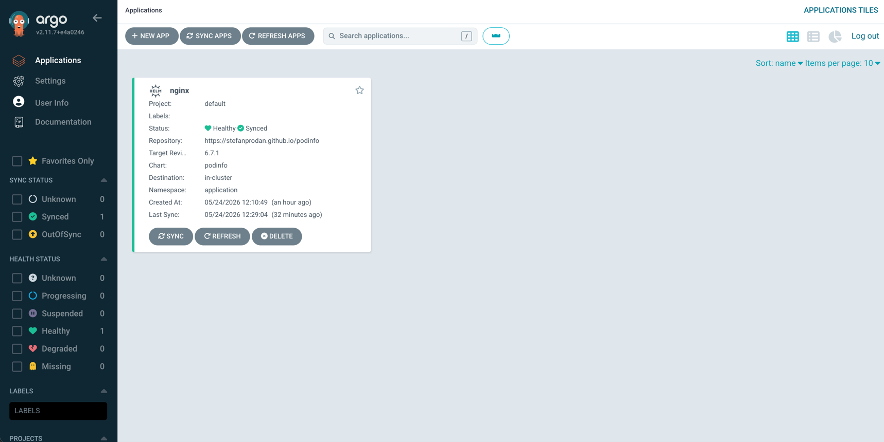
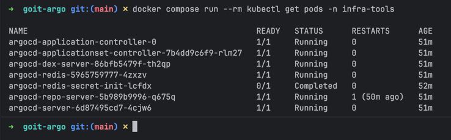
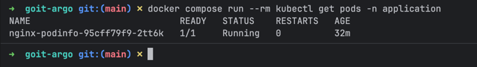
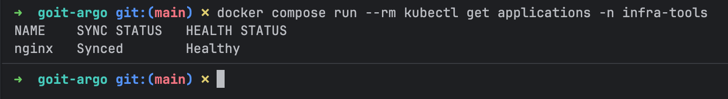

# goit-argo

GitOps deployment: ArgoCD on EKS via Terraform.

## Repository structure

```
goit-argo/
├── namespaces/
│   ├── application/
│   │   ├── ns.yaml         # Namespace for application workloads
│   │   └── nginx.yaml      # ArgoCD Application manifest (nginx)
│   └── infra-tools/
│       └── ns.yaml         # Namespace for ArgoCD
├── terraform/
│   ├── eks/                # EKS cluster
│   └── argocd/             # ArgoCD Helm release
│       └── values/
│           └── argocd-values.yaml
├── docker-compose.yml
└── README.md
```

## Prerequisites

- Docker
- AWS credentials configured at `~/.aws`

All commands run inside Docker — no local Terraform, kubectl, or Helm required.

## Step 1 — Create S3 bucket for Terraform state

```bash
docker run --rm \
  -v ~/.aws:/root/.aws:ro \
  amazon/aws-cli \
  s3 mb s3://goit-tf-state-208337080520 --region us-east-1
```

## Step 2 — Deploy EKS cluster

```bash
docker compose run --rm terraform -chdir=terraform/eks init
docker compose run --rm terraform -chdir=terraform/eks apply
```

Takes ~15 minutes. After apply, configure kubectl:

```bash
docker run --rm \
  -v ~/.aws:/root/.aws:ro \
  -v ~/.kube:/root/.kube \
  amazon/aws-cli \
  eks update-kubeconfig --region us-east-1 --name goit-eks-cluster
```

## Step 3 — Deploy ArgoCD

```bash
docker compose run --rm terraform -chdir=terraform/argocd init
docker compose run --rm terraform -chdir=terraform/argocd apply
```

### Verify ArgoCD pods are running

```bash
docker compose run --rm kubectl get pods -n infra-tools
```

Expected output — several pods with `argocd-` prefix:

```
NAME                                                READY   STATUS    RESTARTS
argocd-application-controller-0                     1/1     Running   0
argocd-applicationset-controller-xxx                1/1     Running   0
argocd-dex-server-xxx                               1/1     Running   0
argocd-notifications-controller-xxx                 1/1     Running   0
argocd-redis-xxx                                    1/1     Running   0
argocd-repo-server-xxx                              1/1     Running   0
argocd-server-xxx                                   1/1     Running   0
```

## Step 4 — Access ArgoCD UI

### Port-forward

```bash
docker compose run --rm -p 8080:8080 kubectl \
  port-forward svc/argocd-server -n infra-tools 8080:443
```

Open in browser: **http://localhost:8080**

### Get admin password

```bash
docker compose run --rm kubectl \
  get secret argocd-initial-admin-secret \
  -n infra-tools \
  -o jsonpath='{.data.password}' | base64 -d
```

Login: `admin` / `<password from above>`

## Step 5 — Deploy nginx via ArgoCD

Apply the ArgoCD Application manifest:

```bash
docker compose run --rm kubectl apply -f namespaces/application/nginx.yaml
```

ArgoCD will automatically sync and deploy nginx into the `application` namespace.

> Application manifest: [namespaces/application/nginx.yaml](https://github.com/YOUR_USERNAME/goit-argo/blob/lesson-7/namespaces/application/nginx.yaml)

### Verify deployment

```bash
docker compose run --rm kubectl get applications -n infra-tools
docker compose run --rm kubectl get pods -n application
```

### Access nginx via port-forward

```bash
docker compose run --rm -p 8888:80 kubectl \
  port-forward svc/nginx -n application 8888:80
```

Open in browser: **http://localhost:8888**

## Screenshots

**ArgoCD UI — Application Synced & Healthy**


**ArgoCD pods running in infra-tools namespace**


**Application pod running in application namespace**


**ArgoCD Application sync status**


## Teardown

Destroy in reverse order to avoid dependency errors:

```bash
docker compose run --rm terraform -chdir=terraform/argocd destroy
docker compose run --rm terraform -chdir=terraform/eks destroy
```

> The S3 bucket is intentionally left intact to preserve Terraform state history.
